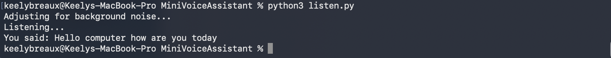

# Mini Voice Assistant

## Overview
This is a simple voice assistant built in Python. It can listen to your voice, recognize what you say, and display the text in the terminal. This project demonstrates basic Python programming, working with audio input, and speech recognition.

## Features
- Listen to microphone input
- Convert speech to text using Google Speech Recognition
- Print recognized text in the terminal
- Adjustable for background noise

*Program running and converting speech to text in Terminal.*

## How to Run
1. Make sure **Python 3** is installed on your computer.
2. Install required packages by running this command in Terminal (from the MiniVoiceAssistant folder):
	'''bash
	pip install -r requirements.txt