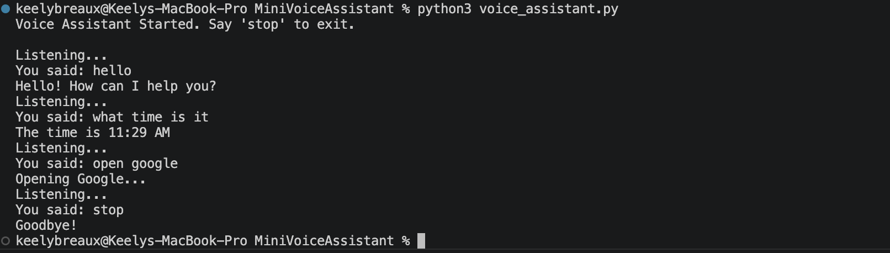

# Mini Voice Assistant

## Overview
This is a Python-based voice command assistant that listens to user input through the microphone, converts speech to text, and executes commands in real time. The assistant can respond to greetings, tell the current time, and open websites such as Google and YouTube. This project demonstrates working with speech recognition, handling real-time audio input, and building interactive command-based systems in Python.

## Features
- Listen to microphone input
- Convert speech to text using Google Speech Recognition
- Recognizes voice commands
- Responds to commands (greetings, time, web actions)
- Opens websites like Google and YouTube
- Continuous listening until user says "stop"

## Demo

## How to Run
1. Make sure **Python 3** is installed on your computer.
2. Install required packages by running this command in Terminal (from the MiniVoiceAssistant folder):
	'''bash
	pip install -r requirements.txt

## What I Learned
- How to capture and process real-time audio input using Python
- How to convert speech to text using speech recognition libraries
- How to structure a program to continuously listen for and respond to user commands
- How to implement command-based logic using conditional statements
- How to integrate Python with system-level actions like opening web browsers

## Future Improvements
- Add more advanced natural language understanding
- Support additional voice commands
- Improve response accuracy and handling of background noise
- Integrate APIs for more dynamic responses